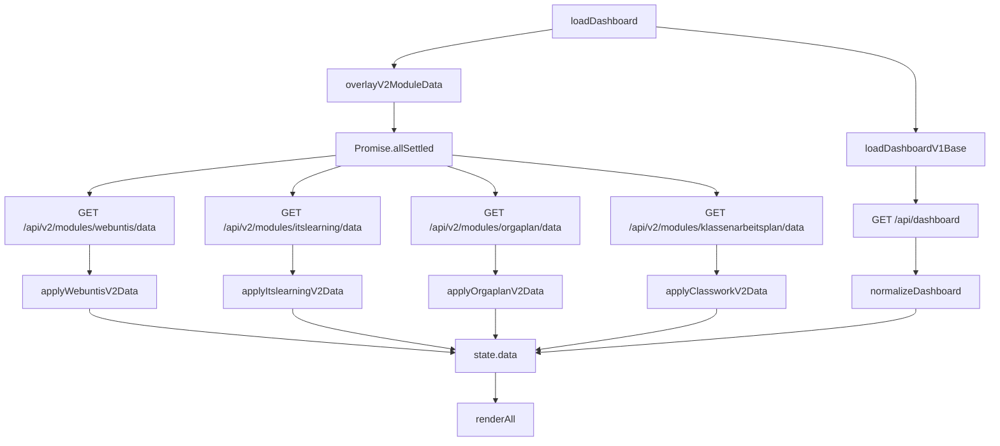

# Phase 11 Implementation Plan — Lehrercockpit SaaS

**Date:** 2026-03-26  
**Based on:** Phase 10 completed (HEAD: Phase 10h — `webuntis.js` extracted, audit log CSV, rate limit ENV-driven, operations runbook)  
**Audit performed against:** `src/app.js`, `backend/dashboard.py`, `backend/api/module_routes.py`, `backend/api/dashboard_routes.py`, `src/features/webuntis.js`, `src/features/grades.js`, `src/api-client.js`, `index.html`, `CLAUDE_HANDOFF.md`

---

## Executive Summary

Phase 11 is the **v1→v2 dashboard migration**. The single most important technical debt item is that `src/app.js` still calls the legacy `GET /api/dashboard` (v1) for every dashboard load, which uses global `.env.local` settings (server-wide, not per-user). All individual module v2 data endpoints already exist on the backend. Phase 11 wires the frontend to call them directly via `Promise.allSettled()`, eliminating the v1 monolithic call for the four key data modules (WebUntis, itslearning, Nextcloud, classwork/orgaplan), and extracts `src/features/itslearning.js` as the next modularization step.

---

## Section 1: Current `loadDashboard()` Analysis

### URL(s) Fetched

**File:** [`src/app.js`](src/app.js:212)

```javascript
// Local runtime:
GET /api/dashboard          // Flask dev server
GET ./data/mock-dashboard.json  // fallback

// Production (MULTIUSER_ENABLED=true, Netlify→Render):
GET https://api.lehrercockpit.com/api/dashboard  // v1 legacy
GET ./data/mock-dashboard.json                    // fallback
```

After the v1 call, a **second fetch** overlays v2 grades/notes:

```javascript
// src/app.js line 231 — Phase 9e overlay:
if (window.LehrerGrades && window.MULTIUSER_ENABLED && window.LehrerAPI) {
  const v2Data = await window.LehrerAPI.getNotesData();  // GET /api/v2/modules/noten/data
  if (v2Data.ok) {
    data.grades = json.grades || [];
    data.notes  = json.notes  || [];
  }
}
```

### What `normalizeDashboard()` Does

**File:** [`src/app.js`](src/app.js:256)

`normalizeDashboard()` is a **safe default injector**. It:
1. Deep-copies the payload
2. Ensures `generatedAt` is set (fallback: `Date.now()`)
3. Ensures `meta.lastUpdatedLabel` is set
4. Injects a complete default `webuntisCenter` object if missing — with empty `events`, empty `finder.entities`, `status: "warning"`
5. Injects a complete default `planDigest` object if missing — with stub `orgaplan` and `classwork` objects

It does **NOT** fetch anything — it's purely defensive normalization.

### What `getData()` Exposes

**File:** [`src/app.js`](src/app.js:318)

`getData()` returns `state.data` or a fallback empty object. The full field set consumed by render functions:

| Field | Type | Consumed By |
|---|---|---|
| `meta.mode` | string | `renderRuntimeBanner()` |
| `meta.note` | string | `renderMeta()` |
| `meta.lastUpdatedLabel` | string | `renderMeta()`, `renderRuntimeBanner()` |
| `workspace.eyebrow/title/description` | strings | `renderWorkspace()` |
| `priorities[]` | array | `renderPriorities()`, `renderBriefing()`, stats |
| `messages[]` | array | `renderMessages()`, `renderChannelFilters()`, `renderBriefing()`, stats |
| `documents[]` | array | `renderDocuments()`, stats |
| `sources[]` | array | `renderSources()`, `renderItslearningConnector()`, `renderNextcloudConnector()` |
| `quickLinks[]` | array | `renderQuickLinks()` |
| `berlinFocus[]` | array | `renderBerlinFocus()` |
| `documentMonitor[]` | array | `renderDocumentMonitor()`, `renderDocuments()` |
| `schedule[]` | array | (legacy, not directly rendered in current UI) |
| `webuntisCenter.events[]` | array | `getWebUntisEvents()` → `renderWebUntisSchedule()`, `renderStats()`, `renderBriefing()` |
| `webuntisCenter.finder.entities[]` | array | `renderWebUntisPicker()`, `renderWebUntisWatchlist()` |
| `webuntisCenter.finder.watchlist[]` | array | `renderWebUntisWatchlist()` |
| `webuntisCenter.currentDate` | string | `getWebUntisEvents()` |
| `webuntisCenter.currentWeekLabel` | string | `renderWebUntisControls()` |
| `webuntisCenter.todayUrl/startUrl` | strings | `renderWebUntisControls()` |
| `planDigest.orgaplan` | object | `renderPlanDigest()`, `renderBriefing()`, `pickOrgaplanBriefing()` |
| `planDigest.classwork` | object | `renderPlanDigest()`, `renderClassworkSelector()`, `pickClassworkBriefing()` |
| `localConnections.itslearning` | object | `renderItslearningConnector()` |
| `localConnections.nextcloud` | object | `renderNextcloudConnector()` |
| `generatedAt` | string | `findNextLesson()` |

### Per-User vs. Global Fields

| Field | Scope | Notes |
|---|---|---|
| `webuntisCenter.events` | **per-user** | Built from user's personal iCal URL |
| `webuntisCenter.finder.entities` | per-user (partial) | Rooms/classes extracted from user's events |
| `planDigest.orgaplan` | **global** (central) | Shared school Orgaplan PDF |
| `planDigest.classwork` | **global** (central) | Shared Klassenarbeitsplan |
| `priorities` | mixed | Derived from mail+itslearning+webuntis |
| `messages` | **per-user** | From user's mail + itslearning credentials |
| `sources` | per-user | Reflects user's configured integrations |
| `quickLinks` | **global** (settings) | Same for all users, from `.env.local` |
| `workspace` | **global** | School name from settings |
| `localConnections` | **per-user** | User's itslearning/nextcloud config |
| `berlinFocus` | **global** | Hardcoded items |
| `documentMonitor` | **global** | Watches shared orgaplan PDF URL |

---

## Section 2: v1 Dashboard Payload Anatomy

**File:** [`backend/dashboard.py`](backend/dashboard.py:21) — `build_dashboard_payload()`

### Full Return Value (All Top-Level Keys)

| Key | Data Source | Per-User? | v2 Equivalent? |
|---|---|---|---|
| `generatedAt` | `datetime.now()` | No | Built client-side in v2 |
| `teacher` | `settings.teacher_name`, `settings.school_name` | No | User profile from `/api/v2/auth/me` |
| `workspace` | `_build_workspace(settings)` | No | Static / from user profile |
| `localConnections` | `_build_local_connections(settings)` from `.env.local` | **No (server-wide)** | **Obsolete in SaaS** — use module configs |
| `meta` | Aggregated from 4 adapters | Partial | DEFER — rebuild from module responses |
| `quickLinks` | `_build_quick_links(settings)` from `.env.local` | No | DEFER — admin system_settings |
| `berlinFocus` | `_build_berlin_focus(settings)` | No | DEFER — hardcoded |
| `documentMonitor` | `build_document_monitor()` — HTTP HEAD check on orgaplan URL | No | DEFER — complex, central module |
| `webuntisCenter` | `fetch_webuntis_sync()` via iCal from `.env.local` | **Yes** | ✅ `GET /api/v2/modules/webuntis/data` |
| `planDigest` | `build_plan_digest()` — orgaplan PDF + classwork xlsx | No (central) | ✅ `GET /api/v2/modules/orgaplan/data` + `/klassenarbeitsplan/data` |
| `messages` | `fetch_mail_sync()` + `fetch_itslearning_sync()` | **Yes** | ✅ `GET /api/v2/modules/itslearning/data` |
| `priorities` | Aggregated from mail/itslearning/webuntis/orgaplan | **Yes** | Built client-side from module responses |
| `documents` | mock-dashboard.json + plan_digest overlay | No | DEFER — central, low urgency |
| `sources` | mock-dashboard.json + adapter overlays | Partial | DEFER — rebuild from module responses |
| `schedule` | `webuntis_sync.schedule` | **Yes** | From `/api/v2/modules/webuntis/data` |

### Data Source Detail

| Key | Backend Module | External Call? |
|---|---|---|
| `webuntisCenter.events` | [`backend/webuntis_adapter.py`](backend/webuntis_adapter.py) | HTTP GET to iCal URL |
| `messages` (itslearning) | [`backend/itslearning_adapter.py`](backend/itslearning_adapter.py) | HTTP POST to berlin.itslearning.com |
| `messages` (mail) | [`backend/mail_adapter.py`](backend/mail_adapter.py) | IMAP or local account |
| `planDigest.orgaplan` | [`backend/plan_digest.py`](backend/plan_digest.py) | HTTP GET to PDF URL + pypdf |
| `planDigest.classwork` | [`backend/plan_digest.py`](backend/plan_digest.py) | Local xlsx file or HTTP |
| `localConnections` | [`backend/config.py`](backend/config.py) / `.env.local` | File read |
| `documentMonitor` | [`backend/document_monitor.py`](backend/document_monitor.py) | HTTP HEAD to orgaplan URL |
| `quickLinks` | `_build_quick_links(settings)` | None — from settings |
| `workspace` | `_build_workspace(settings)` | None — from settings |

### v2 Migration Status Matrix

| v1 Key | v2 Endpoint | Status |
|---|---|---|
| `grades` (injected post-load) | `GET /api/v2/modules/noten/data` | ✅ **DONE (Phase 9)** |
| `notes` (injected post-load) | `GET /api/v2/modules/noten/data` | ✅ **DONE (Phase 9)** |
| `webuntisCenter` | `GET /api/v2/modules/webuntis/data` | ✅ Endpoint ready, **frontend NOT wired** |
| `messages` (itslearning) | `GET /api/v2/modules/itslearning/data` | ✅ Endpoint ready, **frontend NOT wired** |
| `localConnections` (itslearning) | `GET /api/v2/modules/itslearning/config` | ✅ Config stored in DB |
| `localConnections` (nextcloud) | `GET /api/v2/modules/nextcloud/config` | ✅ Config stored in DB |
| `planDigest.orgaplan` | `GET /api/v2/modules/orgaplan/data` | ✅ Endpoint ready, **frontend NOT wired** |
| `planDigest.classwork` | `GET /api/v2/modules/klassenarbeitsplan/data` | ✅ Endpoint ready, **frontend NOT wired** |
| `quickLinks` | None — admin system_settings | ❌ No v2 equivalent |
| `workspace` | User profile / system_settings | ❌ No v2 equivalent |
| `sources` | Aggregated from module data | ❌ No v2 equivalent |
| `documentMonitor` | None | ❌ Complex, not yet migrated |
| `berlinFocus` | None | ❌ Hardcoded |
| `meta` | Aggregated | ❌ No v2 equivalent |

---

## Section 3: V2 Migration Strategy Per Module

### `webuntisCenter` — **BUILD NOW**

- **Proposed v2 path:** `GET /api/v2/modules/webuntis/data` (already exists)
- **Returns:** `WebUntisSyncResult` as dict: `{source, events[], schedule[], priorities[], mode, note}` (fixed with `dataclasses.asdict()` in Phase 10)
- **Data source:** [`backend/webuntis_adapter.py`](backend/webuntis_adapter.py) — fetches user's iCal URL from `user_module_configs.config_data["ical_url"]`
- **Frontend consumers:** `renderWebUntisControls()`, `renderWebUntisSchedule()`, `renderWebUntisWatchlist()`, `renderWebUntisPicker()`, `renderStats()`, `renderBriefing()`, `findNextLesson()`
- **Shape mapping:** v2 response `data.events` maps directly to `state.data.webuntisCenter.events`; must reconstruct `webuntisCenter` shape from v2 `data` dict
- **Response shape transformation needed:**
  ```javascript
  // v2 data → webuntisCenter shape
  state.data.webuntisCenter = {
    status: v2Data.data.source.status,
    note: v2Data.data.note,
    detail: v2Data.data.source.detail,
    events: v2Data.data.events,
    ...normalizeDashboard({}).webuntisCenter,  // preserve defaults
  };
  ```

### `messages` + itslearning source — **BUILD NOW**

- **Proposed v2 path:** `GET /api/v2/modules/itslearning/data` (already exists)
- **Returns:** `ItslearningSyncResult` (currently as-is, needs `dataclasses.asdict()` fix — same bug as WebUntis had)
- **Data source:** [`backend/itslearning_adapter.py`](backend/itslearning_adapter.py) — calls berlin.itslearning.com using credentials from `user_module_configs`
- **Frontend consumers:** `renderMessages()`, `renderChannelFilters()`, `renderSources()`, `renderPriorities()`, `renderItslearningConnector()`, `pickInboxBriefing()`
- **Shape mapping:** `v2Data.data.messages` → overlay onto `state.data.messages` (filter out itslearning channel, replace with v2 result); `v2Data.data.source` → overlay into `state.data.sources`
- **Note:** `renderItslearningConnector()` currently only shows on `IS_LOCAL_RUNTIME`. In SaaS mode the card is hidden. The itslearning **status display** in the connector card will need re-evaluation but is low priority.

### `planDigest.orgaplan` — **BUILD PARTIAL**

- **Proposed v2 path:** `GET /api/v2/modules/orgaplan/data` (already exists)
- **Returns:** `{"data": {"url": ..., "pdf_url": ...}}` — **only URLs, not digest content**
- **Current gap:** The endpoint only returns URLs from `system_settings`, not the parsed PDF content. `build_plan_digest()` in the v1 backend actually parses the PDF via pypdf and returns `{highlights, upcoming, monthLabel}`.
- **Recommendation:** Phase 11 should enhance `GET /api/v2/modules/orgaplan/data` to also return the parsed digest (call `build_plan_digest()` internally). Keep v1 as fallback for now.
- **Frontend consumers:** `renderPlanDigest()`, `renderBriefing()`, `pickOrgaplanBriefing()`

### `planDigest.classwork` — **BUILD PARTIAL**

- **Proposed v2 path:** `GET /api/v2/modules/klassenarbeitsplan/data` (already exists)
- **Returns:** `{"data": {"url": ..., "structured_rows": [...]}}` — reads local xlsx file
- **Current state:** Returns `structured_rows` from `load_classwork_plan()` if local xlsx exists. Missing `previewRows`, `entries`, `classes`, `status`, `detail` fields.
- **Recommendation:** Enhance the endpoint to return the full classwork cache/digest shape. Keep v1 as fallback.
- **Frontend consumers:** `renderPlanDigest()`, `renderClassworkSelector()`, `pickClassworkBriefing()`

### `quickLinks` — **DEFER**

- Built from `.env.local` settings (schoolportal URL, webuntis URL, etc.)
- No per-user v2 equivalent. Would require admin configuring these in `system_settings`.
- Low urgency — v1 continues to serve this correctly.
- **Phase 12 recommendation:** Add `GET /api/v2/dashboard/quick-links` that reads `system_settings.quick_links_json`.

### `workspace` (eyebrow/title/description) — **DEFER**

- Built from `settings.teacher_name` + `settings.school_name` (global `.env.local`)
- In SaaS, should come from user profile + school name in system_settings.
- `getData().workspace` is consumed by `renderWorkspace()`.
- **Phase 12 recommendation:** Derive workspace from `window.CURRENT_USER.full_name` + school system_setting.

### `berlinFocus` — **DEFER**

- Hardcoded list in `_build_berlin_focus()`. Informational only, low value.
- No user-specific data. Can stay in v1 indefinitely or be removed.

### `documentMonitor` — **DEFER**

- Requires HTTP HEAD checking + hash comparison of orgaplan PDF.
- Complex operation. Currently works fine via v1.
- **Phase 12:** Could become a server-side periodic job rather than on-demand.

### `sources` — **DEFER** (implicit rebuild)

- `sources[]` is consumed only by `renderSources()` — which is inside a hidden `#sources-section` (`hidden` attribute in `index.html` line 389). **Currently not visible in the UI.**
- No urgency to migrate.

### `meta` — **DEFER**

- `renderMeta()` uses `meta.lastUpdatedLabel` for the hero note timestamp.
- `renderRuntimeBanner()` uses `meta.mode`.
- In v2 world, `meta.lastUpdatedLabel` can be built client-side from `new Date()`.
- `meta.mode` can be derived: if all v2 fetches succeed = "live"; if using mock = "snapshot".

### `localConnections` — **REMOVE (for SaaS)**

- In SaaS mode, `localConnections.itslearning` / `localConnections.nextcloud` is only used by `renderItslearningConnector()` and `renderNextcloudConnector()`.
- Both connector cards are **already hidden** when `!IS_LOCAL_RUNTIME` (lines 803–806, 834–837 in app.js).
- The cards exist for local Mac Mini development mode only.
- **Action:** No migration needed — these render functions early-return on non-local runtime.

---

## Section 4: Dashboard Composition Architecture

### Options Evaluated

#### Option A: `Promise.allSettled()` Parallel Fetch of All Active Module Data Endpoints ✅ RECOMMENDED

```javascript
async function loadDashboardV2() {
  const activeModules = DashboardManager.getActiveModules();  // from layout
  const fetches = {
    webuntis: isModuleActive(activeModules, 'webuntis')
      ? window.LehrerAPI.getModuleData('webuntis') : null,
    itslearning: isModuleActive(activeModules, 'itslearning')
      ? window.LehrerAPI.getModuleData('itslearning') : null,
    orgaplan: isModuleActive(activeModules, 'orgaplan')
      ? window.LehrerAPI.getModuleData('orgaplan') : null,
    klassenarbeitsplan: isModuleActive(activeModules, 'klassenarbeitsplan')
      ? window.LehrerAPI.getModuleData('klassenarbeitsplan') : null,
  };

  const results = await Promise.allSettled(
    Object.entries(fetches)
      .filter(([, p]) => p)
      .map(([key, p]) => p.then(r => r.json()).then(j => [key, j]))
  );

  // Start with v1 data (still fetched as base), overlay with v2 per-module
  const data = await loadDashboardV1();   // keep as base layer
  for (const result of results) {
    if (result.status === 'fulfilled') {
      const [key, json] = result.value;
      if (json.ok) applyModuleData(data, key, json.data);
    }
    // rejected = silently skip, v1 data remains
  }
  return normalizeDashboard(data);
}
```

**Why Option A:**

1. **Error tolerance** — `Promise.allSettled()` guarantees all promises resolve. One module failing (e.g., itslearning is down) does not affect WebUntis data. Each module fails independently. This matches the existing v1 pattern where adapters fail silently.

2. **Module visibility awareness** — By checking `DashboardManager.getActiveModules()` before fetching, disabled modules are not fetched at all. This is critical: a teacher who hasn't configured itslearning should not get a 401 error on every page load.

3. **Incremental migration** — v1 `GET /api/dashboard` can be kept as the base payload. v2 module fetches **overlay** specific fields on top. This means the migration is fully backward compatible: any module without a v2 equivalent still gets data from v1.

4. **No bundler required** — `Promise.allSettled()` is available in all modern browsers. The IIFE pattern in `src/app.js` is fully compatible. No async library needed.

5. **Performance** — All 4 module fetches are concurrent (parallel), not sequential. Network latency is the bottleneck for all 4 simultaneously, not 4× sequential.

**Why NOT Option B (single server-side aggregator):**

- `GET /api/v2/dashboard/data` would need to call all adapters internally — recreating v1 `build_dashboard_payload()`. This adds server-side complexity without any gain.
- Per-user module visibility is already checked frontend-side by `DashboardManager`.
- A server-side aggregator would need to handle partial failures identically to what `Promise.allSettled()` does client-side.

**Why NOT Option C (lazy loading):**

- `renderBriefing()`, `renderStats()`, and `findNextLesson()` need `webuntisCenter.events` immediately on page load — lazy loading would cause a visual jump.
- WebUntis data is the most time-sensitive: "current lesson" status requires fresh data on load.

### Proposed `loadDashboardV2()` Architecture

```
loadDashboard() [current entry point — unchanged signature]
├── loadDashboardV1Base()     — existing GET /api/dashboard → normalizeDashboard()
└── Promise.allSettled([
    ├── fetchWebuntisV2()     — GET /api/v2/modules/webuntis/data  → overlay webuntisCenter
    ├── fetchItslearningV2()  — GET /api/v2/modules/itslearning/data → overlay messages[]
    ├── fetchOrgaplanV2()     — GET /api/v2/modules/orgaplan/data → overlay planDigest.orgaplan
    └── fetchClassworkV2()    — GET /api/v2/modules/klassenarbeitsplan/data → overlay planDigest.classwork
    ])
```

The overlay is additive: if a v2 fetch succeeds, its data replaces the corresponding v1 field. If it fails or the module is disabled, the v1 field remains unchanged.

### DashboardManager Integration

[`src/modules/dashboard-manager.js`](src/modules/dashboard-manager.js) already fetches `GET /api/v2/dashboard/layout` and stores module visibility. `loadDashboardV2()` should wait for `DashboardManager.ready()` (or check `DashboardManager.getActiveModuleIds()`) before deciding which v2 module fetches to skip.

Add to `src/api-client.js`:
```javascript
getModuleData: function(moduleId) {
  return apiFetch('/api/v2/modules/' + moduleId + '/data');
},
```

---

## Section 5: itslearning Frontend Extraction

### All itslearning-Related Functions in `src/app.js`

| Function | Approx. Line | Role |
|---|---|---|
| `renderItslearningConnector()` | 798 | Renders the itslearning connect card (local-only) |
| `saveItslearningCredentials()` | 2094 | Saves itslearning username/password via `PUT /api/v2/modules/itslearning/config` |
| `getRelevantInboxMessages()` | 1064 | Filters messages to mail + itslearning channels |
| (inline in `renderMessages()`) | 1033 | Renders itslearning channel messages |
| (inline in `renderChannelFilters()`) | 998 | Channel filter buttons include itslearning |
| (inline in `pickInboxBriefing()`) | 740 | Uses itslearning messages for briefing |

### Dependencies of Each Function

**`renderItslearningConnector()`:**
- `getData().sources` — finds itslearning source status
- `getData().localConnections?.itslearning` — connection config
- `getRelevantInboxMessages()` — count itslearning updates
- `elements.itslearningConnectCard/Status/Copy/Form/Username/Password/Feedback`
- Only runs on `IS_LOCAL_RUNTIME` (early-return on SaaS)

**`saveItslearningCredentials()`:**
- `window.LehrerAPI.saveModuleConfig("itslearning", {...})`
- `elements.itslearningUsername/Password/ConnectFeedback`
- Calls `refreshDashboard(true)` on success

**`getRelevantInboxMessages()`:**
- `getData().messages` — pure data filter, no DOM

### What `src/features/itslearning.js` Would Contain

```javascript
(function () {
  'use strict';

  var _state = null;
  var _elements = null;
  var _callbacks = {};

  // ── Data loading ─────────────────────────────────────────────────────────────
  async function loadItslearning() { ... }
  // GET /api/v2/modules/itslearning/data
  // Sets state.data.messages (itslearning channel) + state.data.sources (itslearning)
  // Calls callbacks.renderMessages() + callbacks.renderChannelFilters()

  // ── Rendering (local-only connector card) ─────────────────────────────────────
  function renderItslearningConnector() { ... }

  // ── Credential management ─────────────────────────────────────────────────────
  async function saveItslearningCredentials() { ... }

  // ── Message helpers ───────────────────────────────────────────────────────────
  function getRelevantInboxMessages(data) { ... }
  function applyItslearningData(currentData, v2Result) { ... }
  // Merges v2 itslearning response into existing state.data

  // ── Public API ────────────────────────────────────────────────────────────────
  function init(state, elements, cbs) {
    _state = state; _elements = elements; _callbacks = cbs || {};
  }

  window.LehrerItslearning = {
    init,
    loadItslearning,
    renderItslearningConnector,
    saveItslearningCredentials,
    getRelevantInboxMessages,
    applyItslearningData,
  };
})();
```

### What Stays in `src/app.js` as Delegates

Following the same pattern as WebUntis (Phase 10c):

```javascript
function renderItslearningConnector() {
  if (window.LehrerItslearning) return window.LehrerItslearning.renderItslearningConnector();
  // TODO: remove fallback after itslearning.js verified
  if (!IS_LOCAL_RUNTIME) { elements.itslearningConnectCard.hidden = true; return; }
  // ... abbreviated fallback
}

async function saveItslearningCredentials() {
  if (window.LehrerItslearning) return window.LehrerItslearning.saveItslearningCredentials();
  // fallback remains in app.js during transition
}

function getRelevantInboxMessages(data = getData()) {
  if (window.LehrerItslearning) return window.LehrerItslearning.getRelevantInboxMessages(data);
  return (data.messages || []).filter(m => m.channel === 'mail' || m.channel === 'itslearning');
}
```

### `index.html` Script Load Order After Phase 11

```html
<script src="./src/api-client.js?v=37"></script>           <!-- 1: window.LehrerAPI -->
<script src="./src/modules/dashboard-manager.js?v=37"></script>  <!-- 2: window.DashboardManager -->
<script src="./src/features/grades.js?v=37"></script>      <!-- 3: window.LehrerGrades -->
<script src="./src/features/webuntis.js?v=37"></script>    <!-- 4: window.LehrerWebUntis -->
<script src="./src/features/itslearning.js?v=37"></script> <!-- 5: window.LehrerItslearning (NEW) -->
<script src="./src/app.js?v=37"></script>                  <!-- 6: main IIFE -->
```

---

## Section 6: V1 Endpoint Retirement Plan

### After Phase 11 Migration

| v1 Endpoint | v2 Equivalent After Phase 11 | Safe to Remove? |
|---|---|---|
| `GET /api/dashboard` | `Promise.allSettled()` of 4 v2 endpoints + v1 base still used | ❌ No — still the base payload provider for `quickLinks`, `workspace`, `berlinFocus`, `sources`, `documentMonitor` |
| `GET /api/grades` | `GET /api/v2/modules/noten/data` (Phase 9) | ✅ **Yes** — `LehrerGrades` in `grades.js` uses v2. v1 is `legacy.getGrades()` only called as fallback in `loadGradebook()` when `!window.LehrerGrades`. Remove the fallback too. |
| `GET /api/notes` | `GET /api/v2/modules/noten/data` (Phase 9) | ✅ **Yes** — same as above. `legacy.getNotes()` only called as fallback. |
| `GET /api/classwork` | `GET /api/v2/modules/klassenarbeitsplan/data` (Phase 11) | ⚠️ Conditional — `loadClassworkCache()` in `app.js` still uses `legacy.getClasswork()`. Must update this call in Phase 11. |
| `POST /api/classwork/upload` | No v2 equivalent | ❌ No — still needed for XLSX upload |
| `POST /api/classwork/browser-fetch` | No v2 equivalent | ❌ No — local-only, still needed |
| `POST /api/local-settings/itslearning` | `PUT /api/v2/modules/itslearning/config` (Phase 8) | ✅ **Yes** — `saveItslearningCredentials()` already uses v2. `legacy.saveItslearning()` is dead code. |
| `POST /api/local-settings/nextcloud` | `PUT /api/v2/modules/nextcloud/config` (Phase 8) | ✅ **Yes** — `saveNextcloudCredentials()` already uses v2. `legacy.saveNextcloud()` is dead code. |
| `POST /api/local-settings/grades` | `POST /api/v2/modules/noten/grades` (Phase 9) | ✅ **Yes** — `LehrerGrades.saveGradeEntry()` uses v2. `legacy.saveGrade()` only called as fallback. |
| `POST /api/local-settings/notes` | `POST /api/v2/modules/noten/notes` (Phase 9) | ✅ **Yes** — same. `legacy.saveNote()` is fallback only. |
| `POST /api/local-settings/classwork-upload` | No v2 equivalent | ❌ No — local Mac Mini workflow |
| `GET /api/health` | N/A | ❌ Keep — monitoring/uptime checks |

### Recommended Retirement Order

**Phase 11 — Can mark as deprecated:**
- `GET /api/grades`, `GET /api/notes`, `POST /api/local-settings/grades`, `POST /api/local-settings/notes` — remove `legacy.*` calls from `api-client.js` and `grades.js`
- `POST /api/local-settings/itslearning`, `POST /api/local-settings/nextcloud` — remove from `api-client.js`

**Phase 12 — After full v1 payload migration:**
- `GET /api/dashboard` — only when `quickLinks`, `workspace`, and `berlinFocus` have v2 equivalents

---

## Section 7: Prioritized Phase 11 Action List

---

### Sprint 11.1 — Critical: Wire v2 Module Data Endpoints (do first)

#### 11.1a: Fix `ItslearningSyncResult` JSON Serialization Bug

**File:** [`backend/api/module_routes.py`](backend/api/module_routes.py:146)

The `itslearning_data()` endpoint has the same dataclass serialization bug that `webuntis_data()` had in Phase 10. `fetch_itslearning_sync()` returns an `ItslearningSyncResult` dataclass — Flask cannot serialize it.

```python
# Current (broken) — line 170:
data = fetch_itslearning_sync(settings, now)
return success({"data": data})   # ← dataclass, not dict → TypeError

# Fix:
import dataclasses
data = fetch_itslearning_sync(settings, now)
return success({"data": dataclasses.asdict(data)})
```

**Expected outcome:** `GET /api/v2/modules/itslearning/data` returns valid JSON.  
**Test:** Add to `tests/test_module_routes.py` — mock `fetch_itslearning_sync`, verify response is JSON-serializable.

#### 11.1b: Fix `NextcloudSyncResult` JSON Serialization Bug

**File:** [`backend/api/module_routes.py`](backend/api/module_routes.py:217)

Same issue with `nextcloud_data()`.

```python
# Current (broken) — line 233:
data = fetch_nextcloud_sync(config)
return success({"data": data})   # ← NextcloudSyncResult dataclass → TypeError

# Fix:
import dataclasses
data = fetch_nextcloud_sync(config)
return success({"data": dataclasses.asdict(data)})
```

**Note:** `fetch_nextcloud_sync()` in [`backend/nextcloud_adapter.py`](backend/nextcloud_adapter.py:21) takes `(settings: NextcloudSettings, now: datetime)` but `nextcloud_data()` calls it with just `config` dict. The signature mismatch must be resolved:
```python
from backend.config import NextcloudSettings
now = datetime.now(timezone.utc)
settings = NextcloudSettings(
    base_url=config.get("base_url", ""),
    username=config.get("username", ""),
    password=config.get("password", ""),
    workspace_url=config.get("workspace_url", ""),
    ...
)
result = fetch_nextcloud_sync(settings, now)
return success({"data": dataclasses.asdict(result)})
```

**Expected outcome:** `GET /api/v2/modules/nextcloud/data` returns valid JSON.

#### 11.1c: Enhance `GET /api/v2/modules/orgaplan/data` to Return Parsed Digest

**File:** [`backend/api/module_routes.py`](backend/api/module_routes.py:239)

Currently only returns `{"url": ..., "pdf_url": ...}`. Needs to call `build_plan_digest()` to return the actual parsed content.

```python
@module_bp.route("/orgaplan/data", methods=["GET"])
@require_auth
def orgaplan_data():
    with db_connection() as conn:
        orgaplan_url = get_system_setting(conn, "orgaplan_url", None)
        pdf_url = get_system_setting(conn, "orgaplan_pdf_url", None)

    digest = {}
    if pdf_url:
        try:
            from backend.plan_digest import build_plan_digest
            from datetime import datetime, timezone
            now = datetime.now(timezone.utc)
            full_digest = build_plan_digest(pdf_url, None, None, now)
            digest = full_digest.get("orgaplan", {})
        except Exception as exc:
            digest = {"status": "error", "detail": str(exc)}

    return success({"data": {
        "url": orgaplan_url,
        "pdf_url": pdf_url,
        "digest": digest,
    }})
```

**Expected outcome:** Frontend can read `json.data.digest` to populate `planDigest.orgaplan`.

#### 11.1d: Enhance `GET /api/v2/modules/klassenarbeitsplan/data` to Return Cache

**File:** [`backend/api/module_routes.py`](backend/api/module_routes.py:259)

Currently returns raw `structured_rows` from local xlsx. Should also return the cached classwork data in the same shape as the v1 `planDigest.classwork` field.

```python
@module_bp.route("/klassenarbeitsplan/data", methods=["GET"])
@require_auth
def klassenarbeitsplan_data():
    with db_connection() as conn:
        url = get_system_setting(conn, "klassenarbeitsplan_url", None)

    # Try classwork cache first (populated by Playwright scraper or XLSX upload)
    from pathlib import Path
    cache_path = Path(__file__).resolve().parent.parent.parent / "data" / "classwork-cache.json"
    if cache_path.exists():
        import json
        cached = json.loads(cache_path.read_text())
        if cached.get("status") == "ok":
            return success({"data": {"url": url, **cached}})

    # Fallback: return structured rows from local xlsx
    ...
```

**Expected outcome:** Frontend gets full classwork digest from v2.

#### 11.1e: Add `getModuleData()` to `src/api-client.js`

**File:** [`src/api-client.js`](src/api-client.js:59)

```javascript
// Add to window.LehrerAPI (Modules v2 section):
getModuleData: function(moduleId) {
  return apiFetch('/api/v2/modules/' + moduleId + '/data');
},
```

**Expected outcome:** Frontend can call `window.LehrerAPI.getModuleData('webuntis')` etc.

#### 11.1f: Implement `loadDashboardV2()` in `src/app.js`

**File:** [`src/app.js`](src/app.js:212)

Replace (or extend) `loadDashboard()` to overlay v2 module data on v1 base:

```javascript
async function loadDashboard(forceRefresh = false) {
  // Step 1: Get v1 base payload (unchanged — provides quickLinks, workspace, etc.)
  const data = await loadDashboardV1Base(forceRefresh);

  // Step 2: Overlay v2 module data when MULTIUSER_ENABLED
  if (window.MULTIUSER_ENABLED && window.LehrerAPI) {
    await overlayV2ModuleData(data);
  }

  return data;
}

async function loadDashboardV1Base(forceRefresh) {
  // ... existing loadDashboard() logic (renamed, unchanged)
}

async function overlayV2ModuleData(data) {
  const activeModuleIds = DashboardManager.getActiveModuleIds
    ? DashboardManager.getActiveModuleIds()
    : ['webuntis', 'itslearning', 'orgaplan', 'klassenarbeitsplan'];

  const moduleFetches = [];
  if (activeModuleIds.includes('webuntis')) {
    moduleFetches.push(
      window.LehrerAPI.getModuleData('webuntis')
        .then(r => r.json())
        .then(j => j.ok && j.data && !j.data.error
          ? applyWebuntisV2Data(data, j.data) : null)
        .catch(() => null)
    );
  }
  if (activeModuleIds.includes('itslearning')) {
    moduleFetches.push(
      window.LehrerAPI.getModuleData('itslearning')
        .then(r => r.json())
        .then(j => j.ok && j.data && !j.data.error
          ? applyItslearningV2Data(data, j.data) : null)
        .catch(() => null)
    );
  }
  if (activeModuleIds.includes('orgaplan')) {
    moduleFetches.push(
      window.LehrerAPI.getModuleData('orgaplan')
        .then(r => r.json())
        .then(j => j.ok && j.data && j.data.digest
          ? applyOrgaplanV2Data(data, j.data) : null)
        .catch(() => null)
    );
  }
  if (activeModuleIds.includes('klassenarbeitsplan')) {
    moduleFetches.push(
      window.LehrerAPI.getModuleData('klassenarbeitsplan')
        .then(r => r.json())
        .then(j => j.ok && j.data && j.data.status === 'ok'
          ? applyClassworkV2Data(data, j.data) : null)
        .catch(() => null)
    );
  }

  await Promise.allSettled(moduleFetches);
}

function applyWebuntisV2Data(data, v2) {
  // v2 = WebUntisSyncResult dict: {source, events, schedule, priorities, mode, note}
  data.webuntisCenter = {
    ...data.webuntisCenter,
    status: v2.source.status,
    note: v2.note,
    detail: v2.source.detail,
    events: v2.events || [],
    schedule: v2.schedule || [],
  };
  if (v2.priorities && v2.priorities.length) {
    data.priorities = _mergeV2Priorities(v2.priorities, data.priorities);
  }
}

function applyItslearningV2Data(data, v2) {
  // v2 = ItslearningSyncResult dict: {source, messages, priorities, mode, note}
  if (v2.messages && v2.messages.length) {
    data.messages = v2.messages.concat(
      (data.messages || []).filter(m => m.channel !== 'itslearning')
    );
  }
  if (v2.source) {
    data.sources = _mergeV2Source(data.sources || [], v2.source);
  }
}

function applyOrgaplanV2Data(data, v2) {
  if (v2.digest && v2.digest.status === 'ok') {
    data.planDigest = data.planDigest || {};
    data.planDigest.orgaplan = { ...data.planDigest.orgaplan, ...v2.digest };
  }
}

function applyClassworkV2Data(data, v2) {
  if (v2.status === 'ok') {
    data.planDigest = data.planDigest || {};
    data.planDigest.classwork = { ...data.planDigest.classwork, ...v2 };
  }
}
```

**Expected outcome:** Dashboard loads v1 base + overlays fresh per-user WebUntis, itslearning, orgaplan, and classwork data from v2 endpoints. Each module failure is silent.

#### 11.1g: Add `getActiveModuleIds()` to `DashboardManager`

**File:** [`src/modules/dashboard-manager.js`](src/modules/dashboard-manager.js)

```javascript
// Add to window.DashboardManager public API:
getActiveModuleIds: function() {
  return (_modules || [])
    .filter(function(m) { return m.is_visible !== false && m.enabled !== false; })
    .map(function(m) { return m.module_id; });
},
```

This allows `overlayV2ModuleData()` to skip fetching data for disabled modules.

---

### Sprint 11.2 — Important: itslearning Frontend Extraction

#### 11.2a: Create `src/features/itslearning.js`

**New file:** [`src/features/itslearning.js`](src/features/itslearning.js)

Implements `window.LehrerItslearning` following the exact same IIFE + `init(state, elements, callbacks)` pattern as `src/features/grades.js` and `src/features/webuntis.js`.

**Functions to move from `src/app.js`:**
- `renderItslearningConnector()` (lines ~798–928) — full implementation
- `saveItslearningCredentials()` (lines ~2094–2120) — full implementation
- `getRelevantInboxMessages()` (lines ~1064–1066) — pure filter

**New function in `src/features/itslearning.js`:**
- `loadItslearning()` — calls `GET /api/v2/modules/itslearning/data`, applies result to `state.data`
- `applyItslearningV2Data(data, v2)` — helper to merge v2 response into dashboard state

**Dependencies via callbacks:**
```javascript
// Callbacks needed from app.js:
{
  getData,           // get current state.data
  renderMessages,    // re-render inbox after itslearning load
  renderChannelFilters, // update channel filter buttons
  renderNavSignals,  // update nav badge indicators
  refreshDashboard,  // full refresh after credential save
  IS_LOCAL_RUNTIME,  // boolean flag
}
```

#### 11.2b: Replace `renderItslearningConnector()` + `saveItslearningCredentials()` in `src/app.js` with Delegates

Following Phase 10c pattern:
```javascript
function renderItslearningConnector() {
  if (window.LehrerItslearning) return window.LehrerItslearning.renderItslearningConnector();
  // TODO: remove fallback after itslearning.js verified
  if (!IS_LOCAL_RUNTIME) { if (elements.itslearningConnectCard) elements.itslearningConnectCard.hidden = true; return; }
}

async function saveItslearningCredentials() {
  if (window.LehrerItslearning) return window.LehrerItslearning.saveItslearningCredentials();
  // abbreviated fallback
}

function getRelevantInboxMessages(data = getData()) {
  if (window.LehrerItslearning) return window.LehrerItslearning.getRelevantInboxMessages(data);
  return (data.messages || []).filter(m => m.channel === 'mail' || m.channel === 'itslearning');
}
```

#### 11.2c: Add `<script>` tag to `index.html` + Wire `init()` in `app.js`

**`index.html`:** Add before `app.js`:
```html
<script src="./src/features/itslearning.js?v=37"></script>
```

**`app.js` `initialize()` function** (~line 2326): Add after LehrerWebUntis init:
```javascript
if (window.LehrerItslearning) {
  window.LehrerItslearning.init(state, elements, {
    getData: getData,
    renderMessages: renderMessages,
    renderChannelFilters: renderChannelFilters,
    renderNavSignals: renderNavSignals,
    refreshDashboard: refreshDashboard,
    IS_LOCAL_RUNTIME: IS_LOCAL_RUNTIME,
  });
}
```

#### 11.2d: Remove Dead Code from `src/api-client.js` Legacy Block

**File:** [`src/api-client.js`](src/api-client.js:143)

Remove from `window.LehrerAPI.legacy`:
- `saveItslearning()` — `saveItslearningCredentials()` uses v2 `saveModuleConfig()` since Phase 8
- `saveNextcloud()` — same
- `saveGrade()` — `LehrerGrades.saveGradeEntry()` uses v2 since Phase 9
- `saveNote()` — same

Keep:
- `getDashboard()` — still the v1 base payload
- `getGrades()`, `getNotes()` — fallback for when `LehrerGrades` doesn't load
- `getClasswork()` — used by `loadClassworkCache()` (update to v2 in Sprint 11.3)

---

### Sprint 11.3 — Cleanup, Testing, Documentation

#### 11.3a: Add Tests for New Backend Endpoints

**File:** [`tests/test_module_routes.py`](tests/test_module_routes.py)

- Test `GET /api/v2/modules/itslearning/data` — mock `fetch_itslearning_sync`, verify JSON-serializable response
- Test `GET /api/v2/modules/nextcloud/data` — mock `fetch_nextcloud_sync`, verify JSON-serializable response
- Test `GET /api/v2/modules/orgaplan/data` — mock `build_plan_digest`, verify digest in response
- Test `GET /api/v2/modules/klassenarbeitsplan/data` — verify cache fallback behavior

#### 11.3b: Add Test for `src/features/itslearning.js` Existence

**File:** [`tests/test_frontend_structure.py`](tests/test_frontend_structure.py)

```python
def test_itslearning_js_exists():
    assert Path("src/features/itslearning.js").exists()

def test_itslearning_js_in_index():
    content = Path("index.html").read_text()
    assert "src/features/itslearning.js" in content

def test_itslearning_js_load_order():
    # Must load after webuntis.js and before app.js
    content = Path("index.html").read_text()
    webuntis_pos = content.index("webuntis.js")
    itslearning_pos = content.index("itslearning.js")
    app_pos = content.index("app.js")
    assert webuntis_pos < itslearning_pos < app_pos
```

#### 11.3c: Update `loadClassworkCache()` to Use v2

**File:** [`src/app.js`](src/app.js:2422)

```javascript
// Replace legacy.getClasswork() with v2 endpoint:
async function loadClassworkCache() {
  try {
    const resp = window.MULTIUSER_ENABLED && window.LehrerAPI
      ? await window.LehrerAPI.getModuleData('klassenarbeitsplan')
      : await window.LehrerAPI.legacy.getClasswork();
    if (!resp.ok) return;
    const data = await resp.json();
    // v2 wraps in {ok, data: {...}}, v1 returns flat
    const payload = data.ok ? data.data : data;
    const hasRows = (payload.entries && payload.entries.length > 0)
                 || (payload.previewRows && payload.previewRows.length > 0);
    if (payload.status === 'ok' && hasRows) {
      renderClassworkData(payload);
    }
  } catch (_err) { /* silently ignore */ }
}
```

#### 11.3d: Update `CLAUDE_HANDOFF.md`

Document Phase 11 completion:
- Mark `GET /api/dashboard` v1 migration as "partial — base payload still used, module data now from v2"
- Add `window.LehrerItslearning` to script load order section
- Update technical debt list (remove itslearning.js TODO, update v1 migration status)

#### 11.3e: Update `_mergeV2Priorities()` and `_mergeV2Source()` Helpers

These are used by `applyWebuntisV2Data()` and `applyItslearningV2Data()`. They should be **private** helpers in `src/app.js` (not exported):

```javascript
function _mergeV2Priorities(incoming, existing) {
  const incomingSources = new Set(incoming.map(p => p.source));
  return [...incoming, ...existing.filter(p => !incomingSources.has(p.source))].slice(0, 4);
}

function _mergeV2Source(existing, sourceUpdate) {
  const merged = existing.filter(s => s.id !== sourceUpdate.id);
  return [sourceUpdate, ...merged];
}
```

---

## Mermaid: Phase 11 Dashboard Data Flow



---

## Risks and Mitigations

### Risk 1: `ItslearningSyncResult` / `NextcloudSyncResult` Dataclass Bug (HIGH)
**Risk:** `GET /api/v2/modules/itslearning/data` and `/nextcloud/data` throw `TypeError` on serialization.  
**Evidence:** Same bug existed on `/webuntis/data` until Phase 10d fix. Both `ItslearningSyncResult` and `NextcloudSyncResult` are `@dataclass` objects.  
**Mitigation:** Fix immediately in Sprint 11.1 (11.1a, 11.1b). Add tests.

### Risk 2: Nextcloud `fetch_nextcloud_sync()` Signature Mismatch (HIGH)
**Risk:** `module_routes.py:nextcloud_data()` calls `fetch_nextcloud_sync(config)` with a raw dict, but the function signature is `fetch_nextcloud_sync(settings: NextcloudSettings, now: datetime)`.  
**Mitigation:** Fix in 11.1b — construct `NextcloudSettings` from config dict before calling.

### Risk 3: DashboardManager `.getActiveModuleIds()` Not Yet Implemented (MEDIUM)
**Risk:** `overlayV2ModuleData()` depends on `DashboardManager.getActiveModuleIds()`. If not added, all 4 modules are always fetched, including ones the user has disabled.  
**Mitigation:** Implement in 11.1g. Fallback: if `DashboardManager.getActiveModuleIds` is not a function, default to fetching all 4 modules (safe, just slightly wasteful).

### Risk 4: orgaplan PDF Parsing Is Slow (MEDIUM)
**Risk:** Calling `build_plan_digest()` inside `GET /api/v2/modules/orgaplan/data` adds a PDF fetch + parse to each dashboard load. pypdf parsing of a large school Orgaplan PDF can take 3–8 seconds.  
**Mitigation:** Cache the digest result server-side (in `system_settings`) with a TTL. Only re-parse if the PDF URL has changed or the cache is older than 1 hour. This is a backend optimization that does not affect the frontend contract.

### Risk 5: `itslearning.js` Extraction Regression (LOW–MEDIUM)
**Risk:** `renderItslearningConnector()` is a complex function touching 15+ DOM elements and conditional logic. Extraction risk is lower than WebUntis (which had the complex picker) but still nonzero.  
**Mitigation:** Follow Phase 10c pattern — keep original in `app.js` with `// TODO: remove after itslearning.js verified` comments. Only delete originals after one sprint of production testing.

### Risk 6: v1 `GET /api/dashboard` Still Called Even After Overlay (ACCEPTABLE)
**Risk:** The v1 dashboard endpoint is still called as the base payload. This means teachers still depend on global `.env.local` settings for `quickLinks`, `workspace`, etc.  
**Rationale:** This is acceptable for Phase 11. The full retirement of `GET /api/dashboard` is deferred to Phase 12 when `quickLinks` and `workspace` have their own v2 equivalents.

---

## File Change Summary

| File | Phase 11 Change |
|---|---|
| `backend/api/module_routes.py` | Fix `itslearning_data()` + `nextcloud_data()` dataclass serialization; enhance `orgaplan_data()` + `klassenarbeitsplan_data()` with parsed content |
| `src/api-client.js` | Add `getModuleData(moduleId)` v2 method; remove dead legacy methods |
| `src/modules/dashboard-manager.js` | Add `getActiveModuleIds()` public method |
| `src/app.js` | Add `loadDashboardV1Base()`, `overlayV2ModuleData()`, `applyWebuntisV2Data()`, `applyItslearningV2Data()`, `applyOrgaplanV2Data()`, `applyClassworkV2Data()`; replace `renderItslearningConnector()` + `saveItslearningCredentials()` with delegates; update `loadClassworkCache()` |
| `src/features/itslearning.js` | NEW — `window.LehrerItslearning` IIFE module |
| `index.html` | Add `<script src="./src/features/itslearning.js">` with bumped version query string |
| `tests/test_module_routes.py` | Tests for itslearning/nextcloud/orgaplan/klassenarbeitsplan v2 endpoints |
| `tests/test_frontend_structure.py` | Tests for `itslearning.js` existence, load order, `LehrerAPI.getModuleData` presence |
| `CLAUDE_HANDOFF.md` | Update Phase 11 completion status, script load order, technical debt list |

---

## Recommended Commit Sequence

1. **11.1a–11.1d** (single commit): `fix: backend v2 module data endpoints — dataclass serialization + enhanced orgaplan/classwork digests`
2. **11.1e–11.